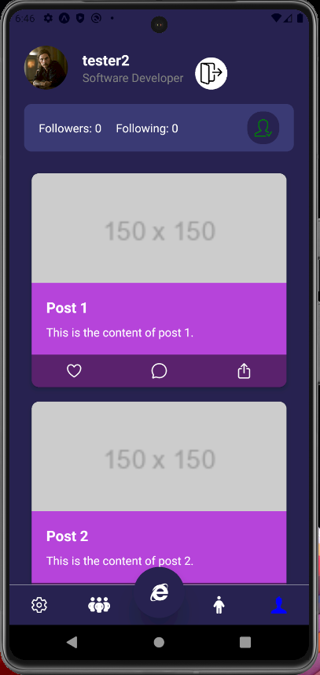
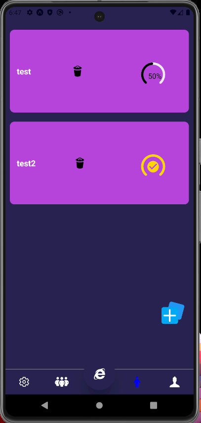
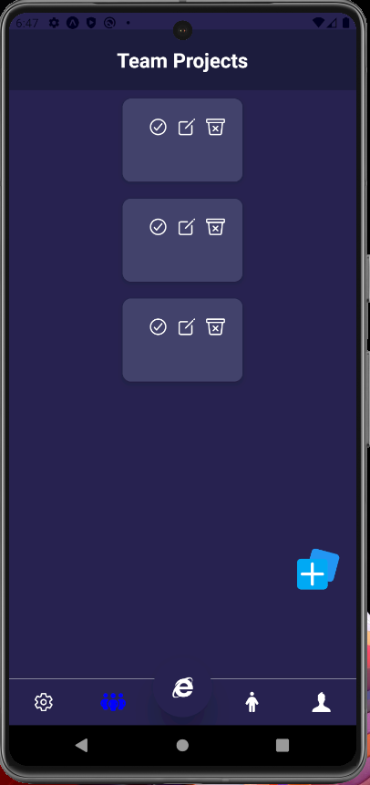

**Accomplish: Your All-in-One Productivity and Collaboration App**

# This project showcases the frontend development for a mobile application built with Expo. While the backend code is included, it's currently not fully integrated for demonstration purposes.

Accomplish is a comprehensive app designed to streamline your tasks, empower teamwork, and unlock the power of global knowledge sharing. Built on the Expo platform, Accomplish offers a robust feature set to help you achieve more, together.


{ style="max-width: 400px;" }
{ style="max-width: 400px;" }
{ style="max-width: 400px;" }


*Key Features*:

**Effortless User Management**: Create a personalized account for seamless interaction within the app. Set up your username and password, and optionally customize your profile.

**Personalized Task Management**: The cornerstone of Accomplish, the Personal Tasks Screen lets you create, edit, and delete tasks within custom lists. Prioritize tasks, set deadlines, and track progress for ultimate organization and productivity.

**Boost Teamwork**: The Team Screen acts as your collaborative hub. Create shared lists, assign tasks, and monitor collective progress in real-time. Built-in communication features keep your team connected and ensure synergy.

**Global Knowledge Sharing**: The Global Feed Page connects you with a worldwide community. Ask questions, share insights, and benefit from diverse perspectives and expertise. Tap into the collective wisdom of Accomplish to enrich your problem-solving and foster a culture of learning.


Accomplish is a versatile and user-friendly solution for managing activities, fostering collaboration, and leveraging collective knowledge. Its intuitive interface, robust features, and global connectivity empower you to optimize your productivity, streamline teamwork, and connect with a vibrant community.

 ```

- Replace `Alt Text` with a description of the image.
- Replace `image-path` with the path to your image file.
- Replace `400px` with your desired maximum width in pixels.

**2. Using HTML Classes with CSS:**

For more control over image size and styling, you can leverage HTML classes and CSS within your README. Here's how:

**a. Create a CSS Class (Optional):**

If you want to reuse the same styling for multiple images, you can define a CSS class in your README:

```markdown
<style>
  .custom-image-size {
    max-width: 400px;
    /* Add other styling properties as needed (e.g., margin, padding) */
  }
</style>
